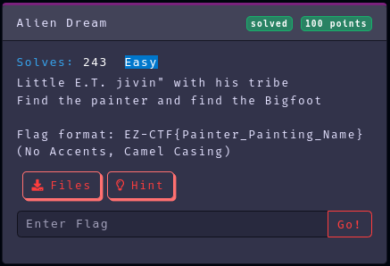
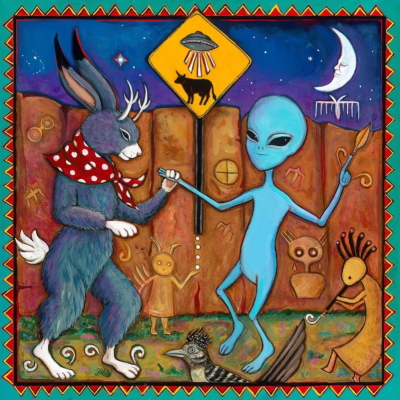
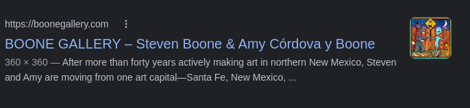
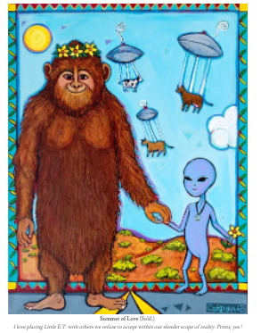

Category: Osint
Difficulty: Easy
Author: @ryurina (loonatic)
___________

This is the file: 

### 1- It's an image, let's use Google reverse image search

So, in the Flag format, they say **No Accents**
Maybe, because the artist name has an accents ???? 

We found the painter's name **"Amy Córdova"**

### 2- Let's visit her gallery and find the "Big foot"
Wow, isn't that "Big Foot"?

Ok, We got the painter and Big foot

#### Flag: EZ-CTF{Amy_Cordova_Summer_Of_Love}
