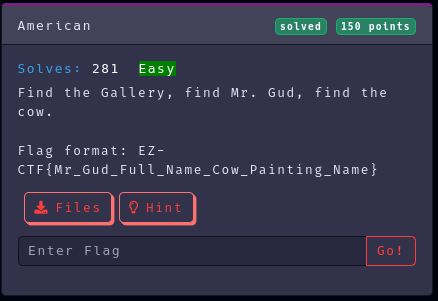
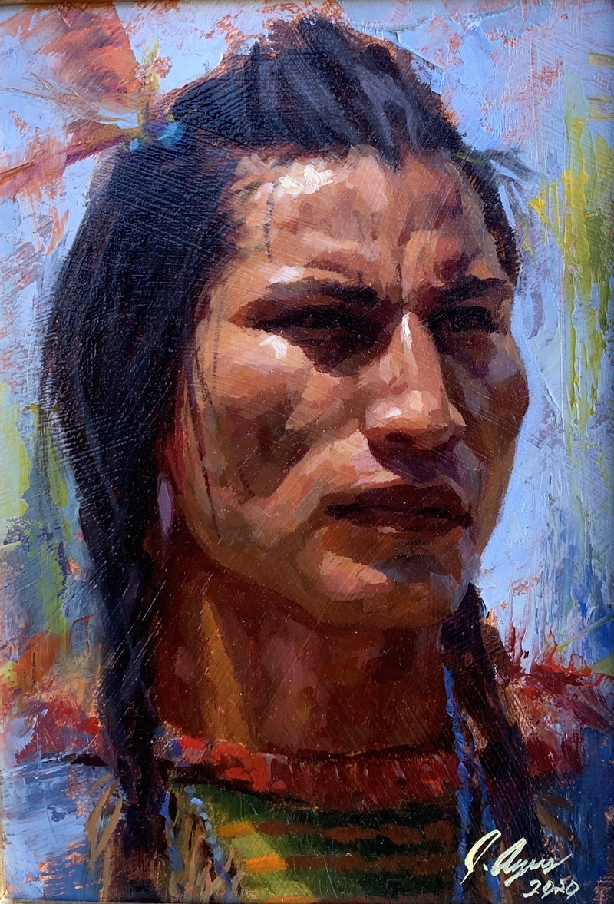
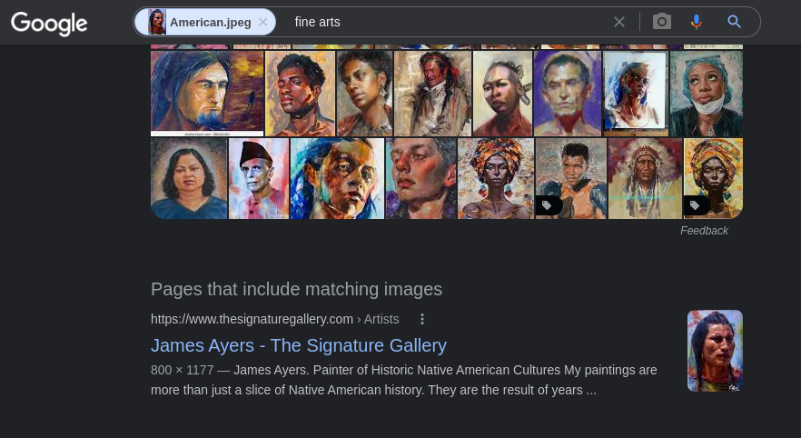
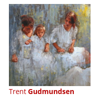
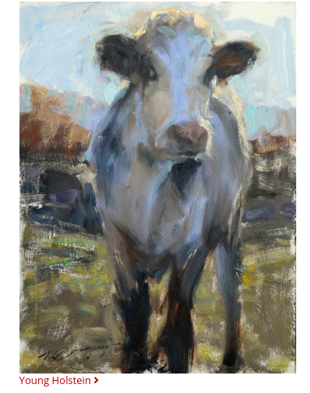

Category: Osint
Difficulty: Easy
Author: @ryurina (loonatic)
___________

**This is the file:**

### 1 - Google reverse image search:

Now, we've done the first task "Find the Gallery"
**=>** https://www.thesignaturegallery.com/

### 2 - Let's find "Mr. Gud"
I clicked on the "ARTIST" section
I found this guy with "Gud" in his name, I said: "Maybe it's him??"

### 3 - Let's find out about this "Mr. Gud" and his "Cow"

Interesting..... He had a cow painting, it's probably him.

And that's how I found the flag! 

#### Flag: EZ-CTF{Trent_Gudmundsen_Young_Holstein}