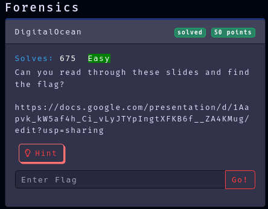

Category: Forensics
Difficulty: Easy
Author: @ryurina (loonatic)
___________

### 1 - Open the link

### 2-  Find all the parts of the flag
##### 1st part in page 2

part 1 of 2 : EZ-CTF{TH1S_

##### 2nd part in page 5

part 2 of 2 : 1S_FR33}

### Flag: EZ-CTF{TH1S_1S_FR33}