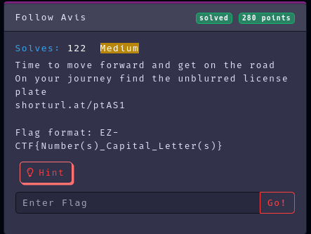
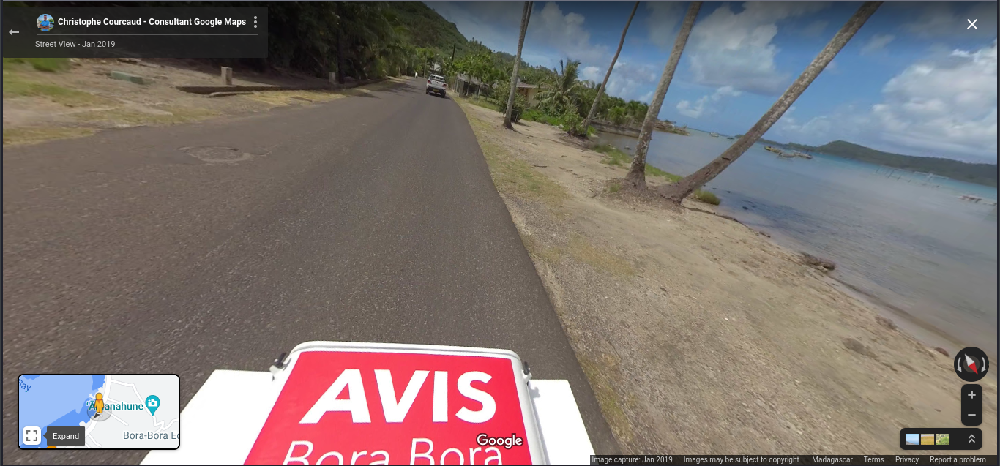
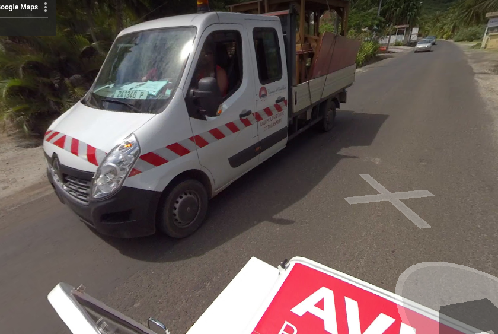

Category: Osint
Difficulty: Medium
Author: @ryurina (loonatic)
___________

### 1- Let's open that link
It's a **Google Map (Street View)**

### 2- Find the unblurred license plate
They say **"move forward"** so, let's do it, and hope we'll find that unblurred license plate

*~A few moments later (with the SpongeBob's narrator voice)~*

Wait a minute... Is that a license plate ??? 

*Note for Google: License plate maybe found on the windshield :D*

#### Flag: EZ-CTF{241340_P}