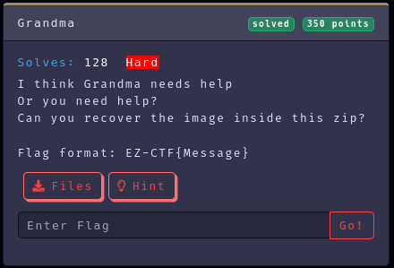
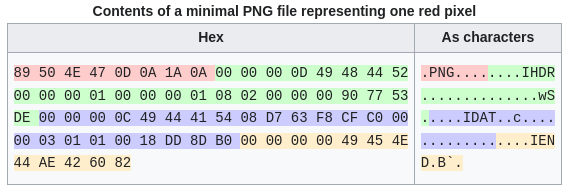
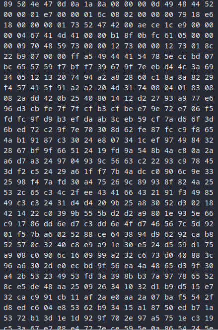
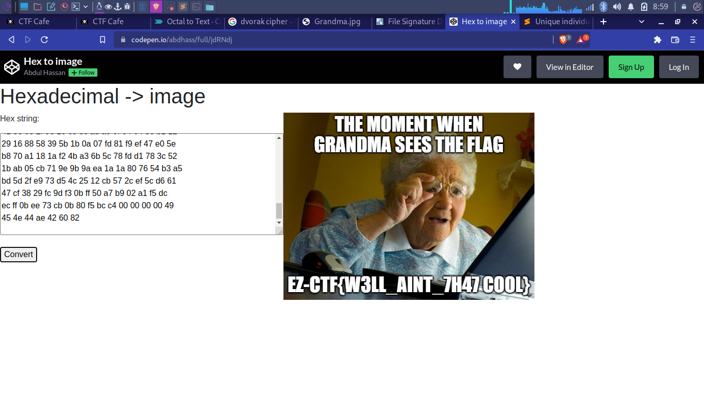

Category: Misc
Difficulty: Hard
Author: @ryurina (loonatic)
___________



##### Download the file, unzip it
It seems not an image but a text, let's open it with "sublime-text"

```text
00000000  XX XX XX 47 0d 0a 1a 0a 00 00 00 0d 49 48 44 52  |.JPG........IHDR|
00000010  00 00 01 e7 00 00 01 6c 08 02 00 00 00 79 18 e6  |...<E7>...l.....y.<E6>|
00000020  18 00 00 00 01 73 52 47 42 00 ae ce 1c e9 00 00  |.....sRGB.<AE><CE>.<E9>..|
00000030  00 04 67 41 4d 41 00 00 b1 8f 0b fc 61 05 00 00  |..gAMA..<B1>..<FC>a...|
00000040  00 09 70 48 59 73 00 00 12 73 00 00 12 73 01 8c  |..pHYs...s...s..|
00000050  22 b9 07 00 00 ff a5 49 44 41 54 78 5e cc bd 07  |"<B9>...<FF><A5>IDATx^̽.|
00000060  bc 65 57 59 f7 bf f7 39 67 9f 7e eb d4 4c 3a 69  |<BC>eWY<F7><BF><F7>9g.~<EB><D4>L:i|
00000070  34 05 12 13 20 74 94 a2 a8 28 60 c1 8a 8a 82 29  |4... t.<A2><A8>(`<C1>...)|
00000080  f4 57 41 5f 91 a2 a2 20 4d 31 74 08 04 01 83 08  |<F4>WA_.<A2><A2> M1t.....|
00000090  08 2a dd 42 0b 25 40 80 14 12 d2 27 93 a9 77 e6  |.*<DD>B.%@...<D2>'.<A9>w<E6>|
000000a0  96 d3 cb fe 7f 7f cf b3 cf be e7 9e 72 e7 06 f5  |.<D3><CB><FE>..ϳϾ<E7>.r<E7>.<F5>|
000000b0  fd fc 9f d9 b3 ef da ab 3c eb 59 cf 7a d6 6f 3d  |<FD><FC>.ٳ<EF>ګ<<EB>Y<CF>z<D6>o=|
000000c0  6b ed 72 c2 9f 7e 70 30 8d 62 fe 87 fc c9 f8 65  |k<ED>r<C2>.~p0.b<FE>.<FC><C9><F8>e|
...
...
```

It seems that they change the file header from PNG to JPG
You can easily recognize PNG file with that "**IHDR**"
So let's change it to the correct hexadecimal value and recover the PNG file.


We need to change the "XX XX XX XX" in the first line to the correct hexadecimal

```text
00000000  XX XX XX 47 0d 0a 1a 0a 00 00 00 0d 49 48 44 52  |.JPG........IHDR|
```

#### That's the correct hex
https://en.wikipedia.org/wiki/Portable_Network_Graphics


#### After fixing it, let's take the hex only and use an online hex to image converter


We will use  "**codepen hex to img**" here
https://codepen.io/abdhass/full/jdRNdj



And we got the flag, Grandma is happy !

#### Flag: EZ-CTF{W3LL_AINT_7H47COOL}