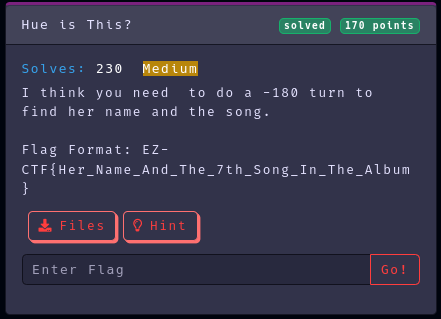
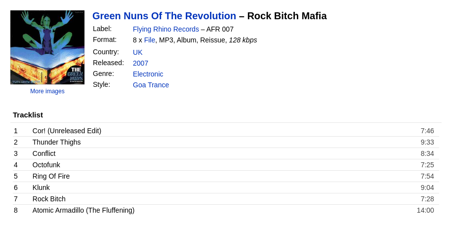
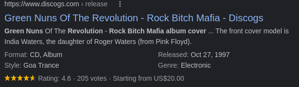

Category: Osint
Difficulty: Medium
Author: @ryurina (loonatic)
___________

### 1- You know the  song: " images + osint = Google reverse image search "

We found the "7th song of the Album"

It's **"Rock Bitch"** (Interesting name :p)

### Let's find out about the girl in the Album cover

I opened **Google** and type : *"Green Nuns Of The Revolution – Rock Bitch Mafia album cover"*

Voilà!!!!
Her name is: **India Waters**

#### Flag: EZ-CTF{India_Waters_Rock_Bitch}