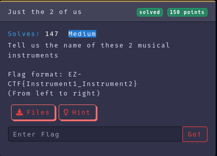
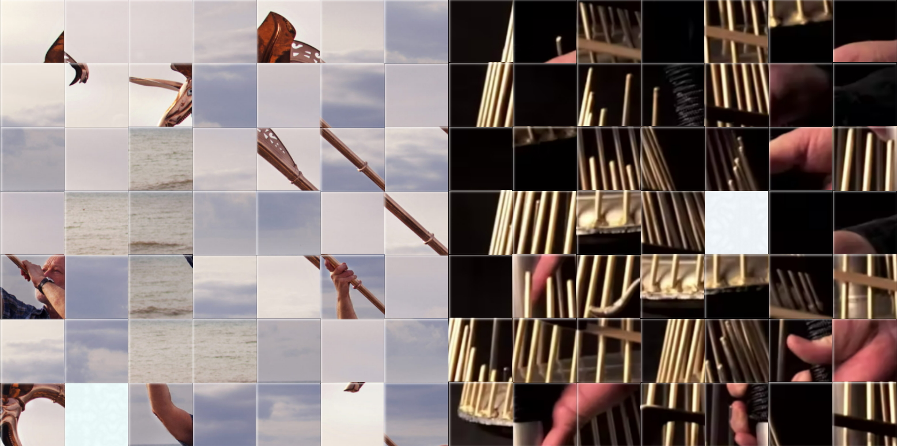
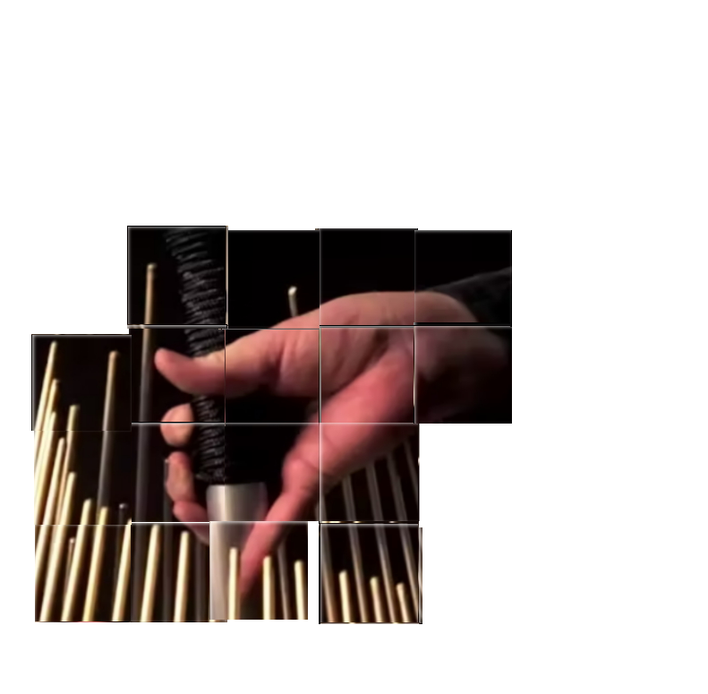
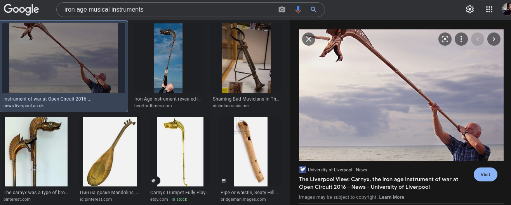
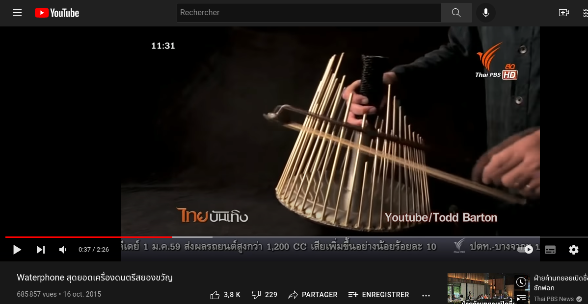

Category: Misc
Difficulty: Medium
Author: @ryurina (loonatic)
___________

##### I reassemble the image like a jigsaw puzzle

##### Then I make Google Reverse Image Search

And I got the name of both instrument: 
Left: Carnyx
Right: Waterphone

### Flag: EZ-CTF{Carnyx_Waterphone}