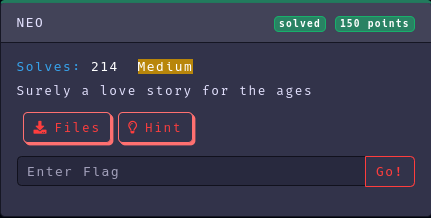
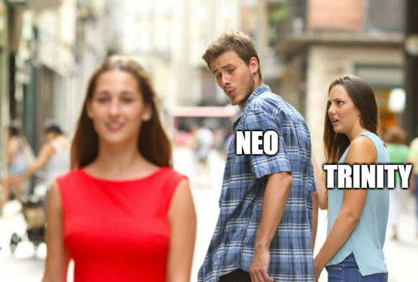
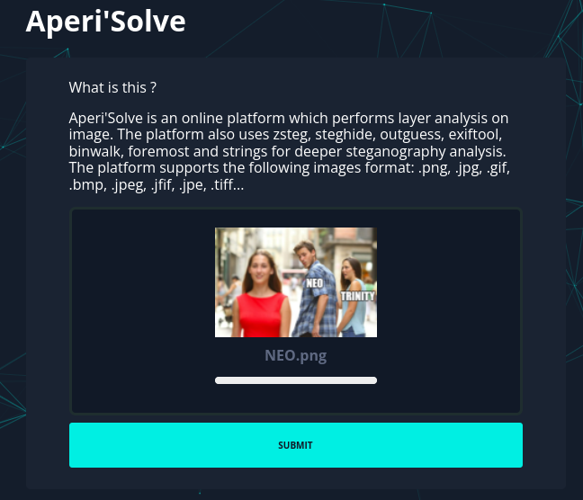
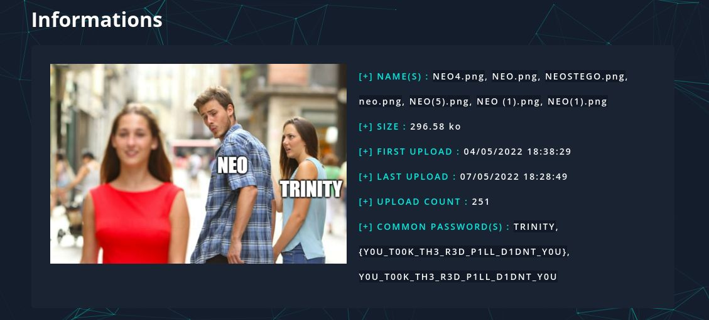
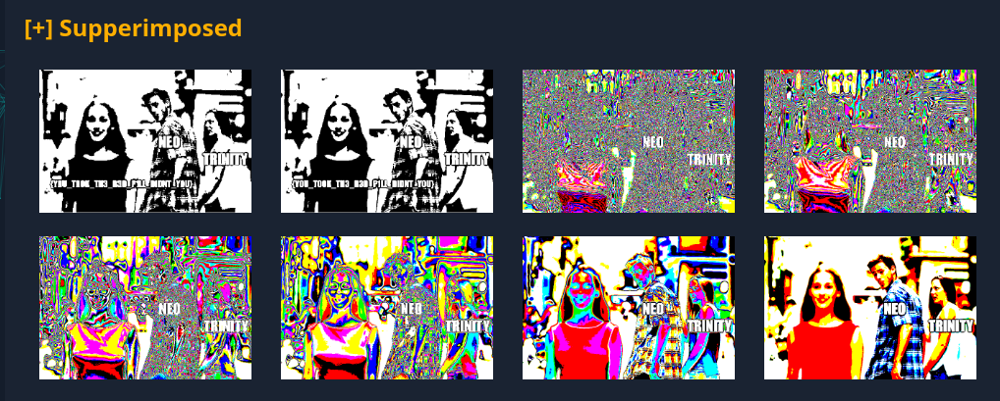

Category: Steganography
Difficulty: Medium
Author: @ryurina (loonatic)
___________

The file content: 

It's a steganography challenge, let's use an automated online tools, cuz I'm lazzzzyyyy and I don't have time.

In this case I use : https://aperisolve.fr/

##### Upload the image:

Click on submit, drink coffee and wait!!!

Now we have some informations

And we got the flag:

(*The "red pill", you got it ??*)

#### Flag: EZ-CTF{YOU_TOOK_TH3_R3D_PILL_DIDNT_YOU}