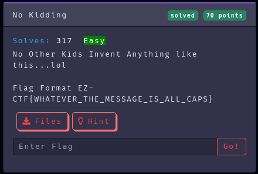
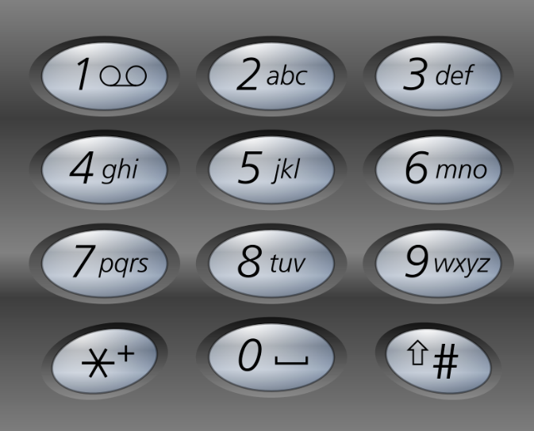

Category: Crypto
Difficulty: Easy
Author: @ryurina (loonatic)
___________

The file content:
```8/44/444/7777\\\444/7777\\\8/44/33\\\555/2/6/33/7777/8\\\222/8/333\\\333/555/2/4\\\33/888/33/33/33/33/777```

At a first sight, it looks like a **Phone keypad**
Sorry for the youngers here, that's what it looks like:


For example, if you want to type the letter "F" you have to type the number "3" three times.

Finally we got this:
```
T H I S\\\I S\\\T H E\\\L A M E S T\\\C T F\\\F L A G\\\E V E E E E R
```

#### Flag: EZ-CTF{THIS_IS_THE_LAMEST_CTF_FLAG_EVEEEER}