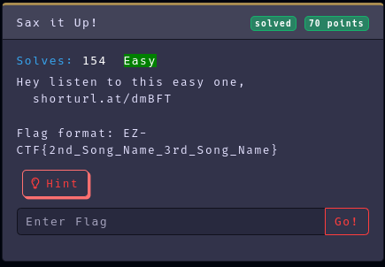
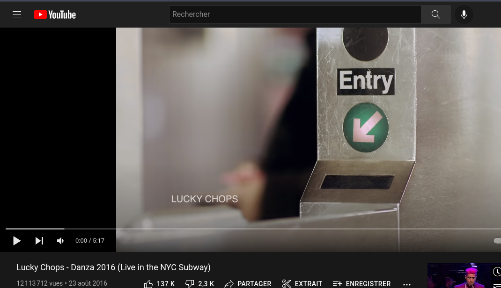
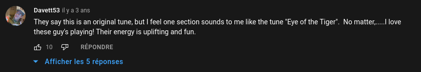
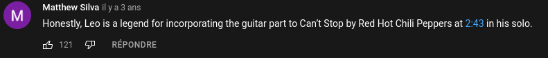

Category: Misc
Difficulty: Easy
Author: @ryurina (loonatic)
___________

##### Open the link
It's an Youtube video (hopefully ti's not rickroll :p)

Let's find out the songs by scrolling comments and listening to the song.

With the help of comments and my music knowledge
We got the songs name

1st song: Don Omar - Danza Kuduro ft. Lucenzo
2nd song: Red Hot Chili Peppers - Can't Stop
3rd song: Survivor - Eye Of The Tiger

And the flag is the name of 2nd song and 3rd song

#### Flag: EZ-CTF{Can't_Stop_Eye_Of_The_Tiger}