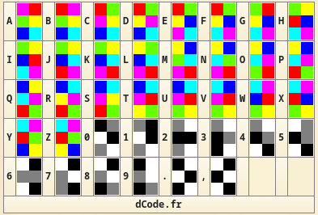

Category: Crypto
Difficulty: Ninja
Author: @ryurina (loonatic)
___________


So, at first glance, it's **Hexahue Cipher**
https://www.dcode.fr/hexahue-cipher


It is easy, isn't it ??
Wait it seems, that your image isn't at the correct position
Let's flip it horizontally and vertically


Now we can decipher it! 
We got : KC4LB_T1_TN14P_U0Y_N4C_7VB_3RUS
When I try EZ-CTF{KC4LB_T1_TN14P_U0Y_N4C_7VB_3RUS}, it said "Wrong Flag!"
Then I thought it seems that the flag is reversed
Let's open **python3** interpreter and type:
```python
>>> "KC4LB_T1_TN14P_U0Y_N4C_7VB_3RUS"[::-1]
'SUR3_BV7_C4N_Y0U_P41NT_1T_BL4CK'
```
And that's it!!!!

#### FLAG: EZ-CTF{SUR3_BV7_C4N_Y0U_P41NT_1T_BL4CK}